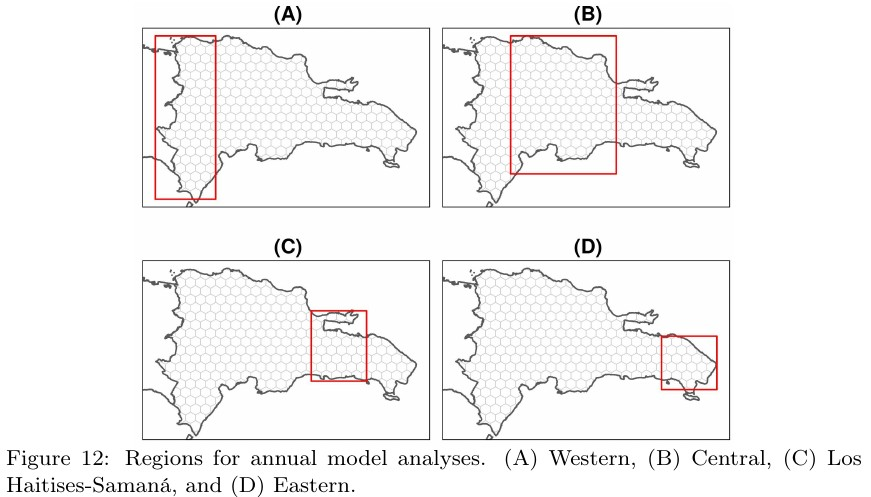

```{r setup, include=FALSE}
knitr::opts_chunk$set(echo = FALSE)
```

```{css, include=FALSE}
.reveal p {
  text-align: left;
}
.reveal ul {
  display: block;
}
.reveal ol {
  display: block;
}  
.extrasmall {
  font-size: 2px;
}
```

# ¿Por qué estudiar deforestación y fuego de manera conjunta?

- Se supone que están relacionados, ¿no? Buej, ese es el punto.

<!-- - El fuego es, sobre todo, una práctica usada en la agricultura. -->


##


##


##


# ¿Qué sabemos sobre la relación fuego/deforestación en RD?

- Que el fuego es un __impulsor__ de la deforestación, y que lo es sobre todo en el __pinar__ [@Lloyd558346].

- Que __hemos perdido más bosque__ del que hemos ganado [@hansen2013high].

- Que hubo __fuego en el Holoceno__ [@kennedy20064000; @horn2000prehistoric].

## ¿Qué sabemos sobre la relación fuego/deforestación?

- Que hay una __relación estrecha entre pérdida de bosque y agricultura migratoria__, esta última dirigida por prácticas de __tumba y quema comenzando en pequeños aclareos__ [@camara1997republica; @zweifler1994landuse; @Lloyd558346; @wendell1974agricultura; @ovalle1984analisis; @panamericana1967reconocimiento; @tolentino1998inventario; @myers2004evaluacion].

- Por lo tanto, medir el grado de __asociación__---*niankesea* "estadística"---entre __fuego y deforestación__, es crucial para estimar __qué tanto contribuye la agricultura__ de subsistencia a la deforestación.

# El problema

- PERO, __con las fuentes nacionales esto no es posible__, porque,

  - o __no son consistentes__ espacial y/o temporalmente,
  
  - o usan unidades territoriales __inhomogéneas__.

## El problema

- NO TODO ESTÁ PERDIDO, hay opciones.


## El problema

- OK, tenemos los datos idóneos, pero surge otro problema: un simple análisis de correlación---y más aún, una modelización---con datos espacializados, normalmente es inviable porque se **viola el principio de independencia de las observaciones** (e.g. datos autocorrelacionados espacialmente).

- También tenemos la solución: **modelos espaciales autorregresivos**.

## 


XKCD comics: https://xkcd.com/1831/

# ¿Qué me planteé?

- **Determinar si existe asociación entre fuego y deforestación, qué tan fuerte es, cuando y dónde**.

- "Ya que" se procesarían millones de celdas, de paso,

  - explorar patrones por __provincias, municipios y AAPP__,
  
  - determinar si hay zonas de __concentración significativa__ del fuego y la deforestación,
  
  - caracterizar la __composición de la deforestación__ según el tamaño de las zonas deforestadas,
  
  - determinar si hay alguna __tendencia__ sostenida.

# ¿Cómo maomeno?

- Cumpliendo los siguientes criterios:

  - Usando __software libre__.
  
  - Usando __datos abiertos__.
  
  - Creando __script reproducible__ abierto al mundo.

{width=75%}

## ¿Cómo maomeno?


## ¿Cómo maomeno?


## ¿Cómo maomeno?

- Enfoque de largo plazo.

{width=90%}

## ¿Cómo maomeno?

- Enfoque anual.

{width=90%}

# ¿Dónde están los resultados?

{width=60%}

<small>Por el momento, aquí: https://www.biorxiv.org/content/10.1101/2021.06.15.448604v2.full</small>

##


<small>https://github.com/geofis/forest-loss-fire-reproducible/data-download-preparation-eda.pdf</small>

## 


<small>https://github.com/geofis/forest-loss-fire-reproducible/data-download-preparation-eda.pdf</small>

## 


<small>https://github.com/geofis/forest-loss-fire-reproducible/data-download-preparation-eda.pdf</small>

## 


<small>https://github.com/geofis/forest-loss-fire-reproducible/data-download-preparation-eda.pdf</small>

## 


<small>https://github.com/geofis/forest-loss-fire-reproducible/data-download-preparation-eda.pdf</small>

##

{width=63%}

# ¿Qué encontré?

## ¿Qué encontré?


## ¿Qué encontré?


## ¿Qué encontré?

Ejemplos simplificados de autocorrelación:


Fuente: http://dx.doi.org/10.4067/S0250-71612012000300004 [@SUAREZ2012]

## ¿Qué encontré?

{width=90%}

## ¿Qué encontré?

__"En promedio, cada anomalía térmica/punto de calor/fuego detectado por los sensores MODIS y VIIRS, se asoció con 1.5 ha y 3 ha de pérdida de bosque, respectivamente"__


## ¿Qué encontré?

{width=60%}

## ¿Qué encontré?

{width=65%}

## ¿Qué encontré?

{width=60%}

## ¿Qué encontré?

{width=60%}

## ¿Qué encontré?

{width=60%}

## ¿Qué encontré?

{width=60%}

## ¿Qué encontré?

- El fuego no es buen predictor de la pérdida de bosque en determinadas regiones

{width=35%}
{width=70%}

## ¿Qué encontré? Recapitulando

- Hemos perdido bosque, y mucho (~3100 km<sup>2</sup>)

- El fuego y la pérdida de bosque están __significativamente asociados__, con un tamaño de efecto importante.

- Las mayores concentraciones de pérdida de bosque y fuego se dieron en __Cord. Central, S. de Bahoruco, Los Haitises/Samaná y las regiones Noroeste y Este__.

- __Dicha asociación fue débil/intermitente__ en el Este, donde el fuego disminuyó y la deforestación aumentó.

- El área deforestada en pequeños (<1 ha) y grandes (>1 ha) desmontes, __¡es básicamente idéntica!__ (~1550 km<sup>2</sup> c/u).

# Gracias por su atención

Vínculo de la presentación

https://geofis.github.io/forest-loss-fire-reproducible

# Referencias

<section style="font-size: 16px; text-align: left;">

